# LR6
Лабораторная работа №6
1. Форкаем репозиторий на свой профиль 
2. Задаем имя пользователя и email  
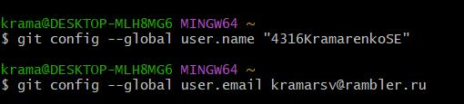 
3. Клонируем удаленный репозиторий на компьютер 
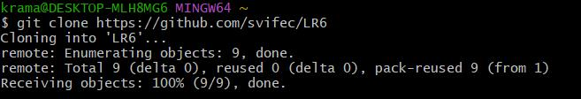
4. Добавляем файл через интерфейс Github
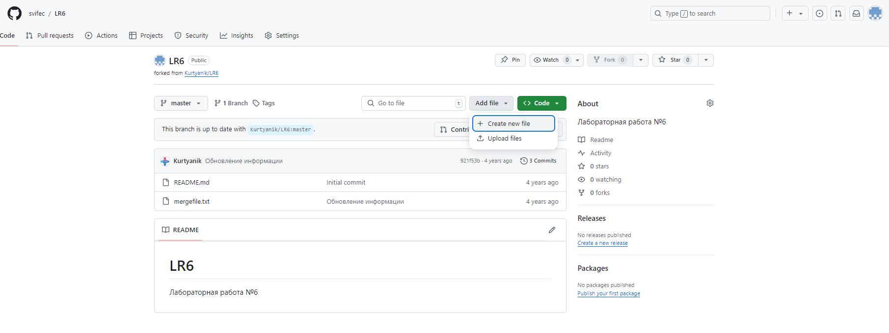
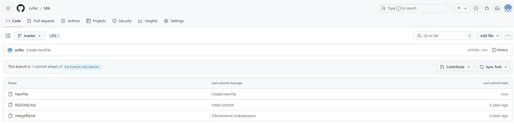
5. Подтягиваем изменения в локальный репозиторий
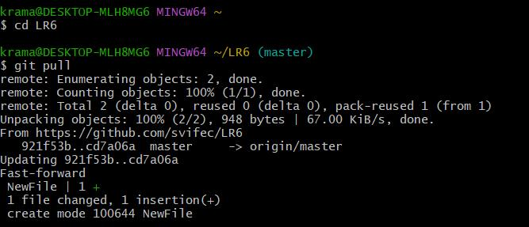
6. Получаем историю для каждой ветки
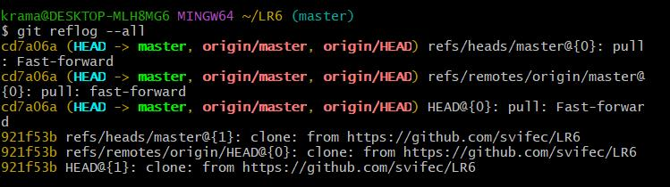
7. Смотрим последние изменения ветки (изменений много, но в качестве примера представил один скриншот)
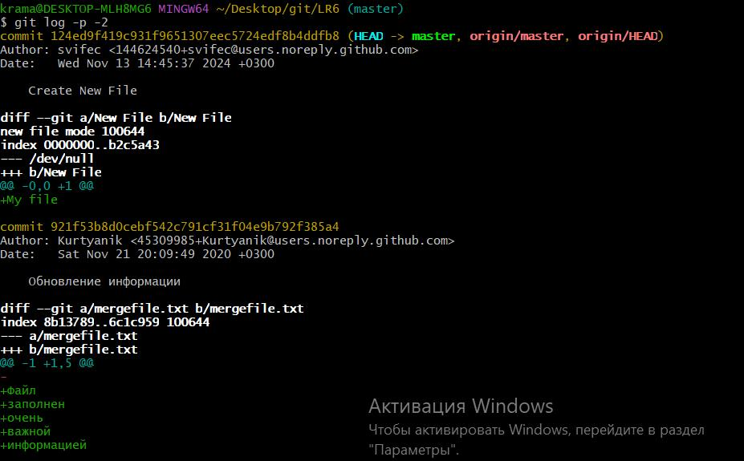
8. Выполняется слияние и разрешается конфиликт  
8.1. Переходим в ветку brunch1  
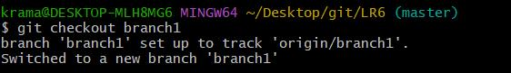 
8.2. Выполняем слияние и получаем сообщение о конфликте 
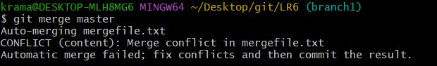 
8.3. Выясняем причину конфликта  
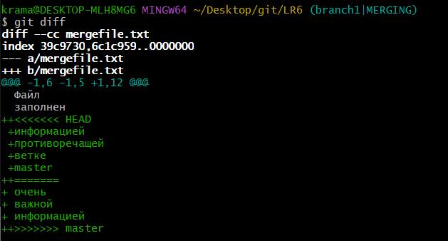 
8.4. Исправляем причину конфикта  
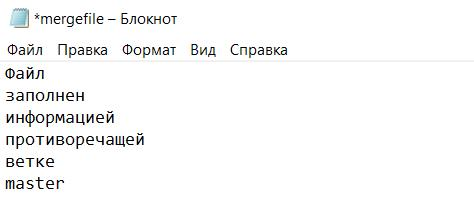  
8.5. Добавляем содержимое рабочего каталога в индекс для последующего коммита  
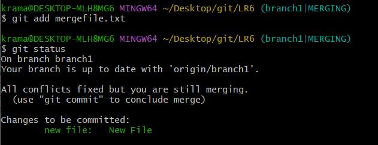  
8.6. Смотрим, исправлена ли ошибка и завершаем merge  
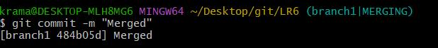
9. Удаляем побочную ветку master  
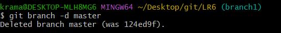
10. Создаю новый файл и коммичу его, оставляя комментарий  
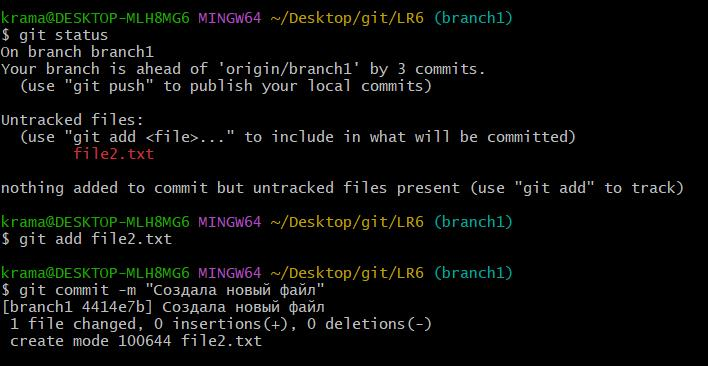  
11. Добавляю строчку в файл  
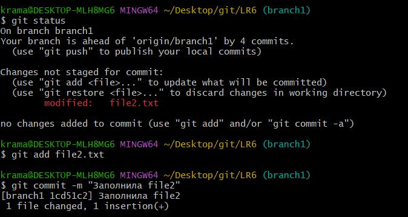  
12. Удаляю строчку из файла
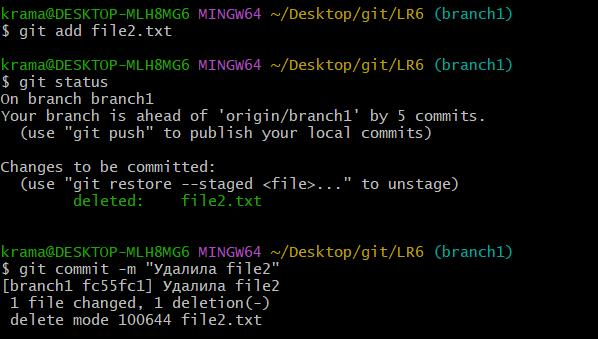
13. Делаю хард откат коммита  
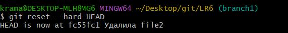
14. Создаю ветку для отчета и перехожу на неё  
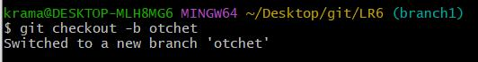
15. Отправляю все данные на удаленный репозиторий 

# Лог команд
git config global user.name/email  
git clone https://github.com/svifec/LR6  
cd LR6  
git pull  
git reflog --all  
git log -p -2  
git checkout branch1  
git merge master  
git diff  
git add mergefile.txt  
git status  
git commit -m "Merged"  
git branch -d master  
git status  
git add file2.txt  
git commit -m "Создала новый файл"  
git status  
git add file2.txt  
git commit -m "Заполнила file2"  
git status  
git add file2.txt  
git status  
git commit -m "Удалила file2"  
git reset --hard HEAD  
git checkout -b otchet  
git push --set-upstream origin otchet  
# История операций
fc55fc1 2024-11-13 | 4316KramarenkoSE | Удалила file2  
1cd51c2 2024-11-13 | 4316KramarenkoSE | Заполнила file2  
4414e7b 2024-11-13 | 4316KramarenkoSE | Создала новый файл  
484b05d 2024-11-13 | 4316KramarenkoSE | Merged  
124ed9f 2024-11-13 | svifec | Create New File  
921f53b 2020-11-21 | Kurtyanik | Обновление информации  
0f9f50d 2020-11-21 | Kurtyanik | Заполнил файл  
c08a654 2020-11-21 | Kurtyanik | Файл создан пустым  
3c6e913 2020-11-21 | Kurtyanik | Initial commit  

